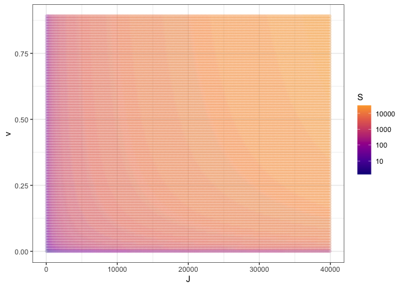
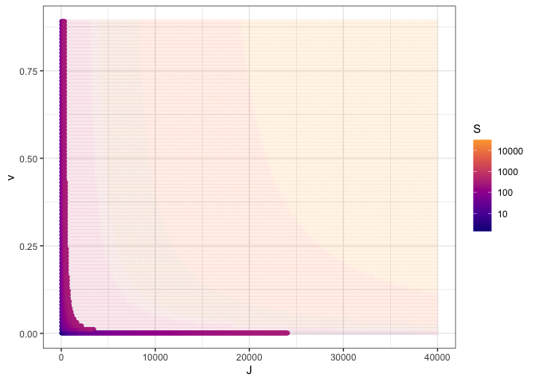
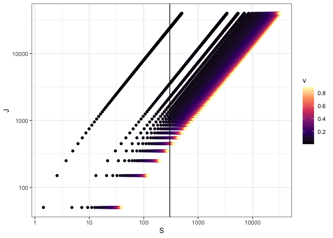
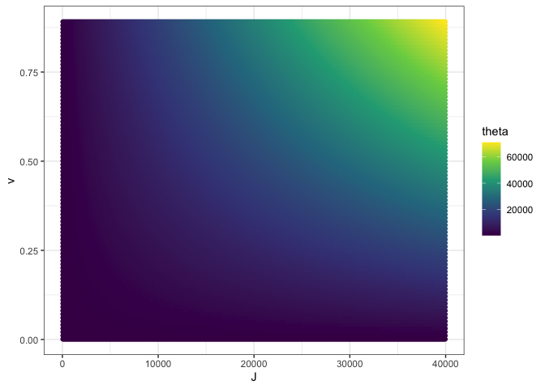
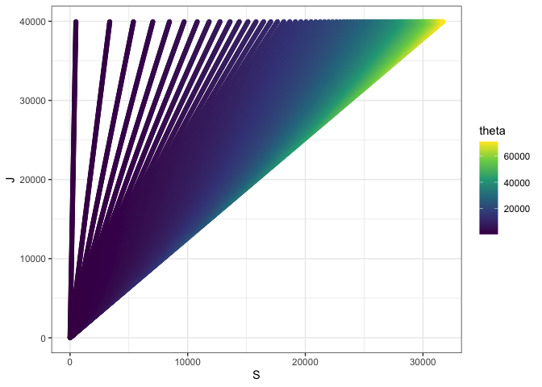

Exploring state space of S, J, v
================

``` r
vs <- seq(.001, .9, by = .01)

js <- seq(50, 40000, by = 100) 

vs_and_js <- expand.grid(vs, js) %>%
  rename(v = Var1,
         J = Var2) %>%
  mutate(theta = get_theta(J = J, v = v)) %>%
  mutate(S = get_S_from_pars(J = J, v= v)) 


ggplot(vs_and_js, aes(J, v, color = S)) + 
  geom_point(alpha = .1) +
  #scale_x_log10() +
  scale_color_viridis_c(option = "plasma", end = .8, trans = "log10") 
```

<!-- -->

``` r
ggplot(vs_and_js, aes(J, v, color = S)) + 
  geom_point(alpha = .02) +
  #scale_x_log10() +
  scale_color_viridis_c(option = "plasma", end = .8, trans = "log10") +
  geom_point(data= filter(vs_and_js, S < 300))
```

<!-- -->

Some interpretation/explanation:

- I am trying to sort out which combinations of $J$ and $v$ to use for
  sampling. I know there are constraints on the sampling that is
  tractable given the feasible set algorithm. For this I need to explore
  the expected values of $S$ that emerge from combinations of $J$ and
  $v$.
- The fastest way I have found to do this is to use Oksanen’s `hubbell`
  package available on R forge here:
  <https://rdrr.io/rforge/hubbell/man/E.S.html>. This package is not
  published, and the note about the derivation of S suggests Oksanen
  hasn’t published that anywhere. But, it’s a means to an end here :).
- Sampling over the range of $J$, $v$:
  - The largest S I have ever sampled is 300. I imagine that can go up
    but not if J is also huge.
  - Keeping S under 300 gives the second plot.

``` r
ggplot((vs_and_js), aes(S, J, color =v)) +
  geom_point() +
  scale_x_log10() +
  scale_y_log10() +
  scale_color_viridis_c(option = "magma") +
  geom_vline(xintercept = (300))
```

<!-- -->

We can proceed with J and v that we feel confident will give S and N
under 300 and 40000 respectively.

This does not feel like a lot of *parameter state space* but it does
cover a lot of *empirical state space* relevant to real data that I have
worked with.

Next steps:

- For a given combination of J and v, we can generate the expected
  equilibrial SAD for a simple (no dispersal) neutral model. I believe
  `untb` can do this and I think that would be preferable to using
  hubbell (not published) or coding from scratch (not published and
  might be buggy).
- Then, for that SAD, generate the feasible set and METE expectation and
  make the comparison.

Next-next steps might go to generating the envelope around that
expectation derived via neutral sampling. That’ll be tricky given the
imprecision of S from J and v but that may be important.

Looking at theta just out of curiousity

``` r
ggplot(vs_and_js, aes(J, v, color = theta)) +
  geom_point() +
  scale_color_viridis_c()
```

<!-- -->

``` r
ggplot(vs_and_js, aes(S, J, color = theta)) +
  geom_point() +
  scale_color_viridis_c()
```

<!-- -->
